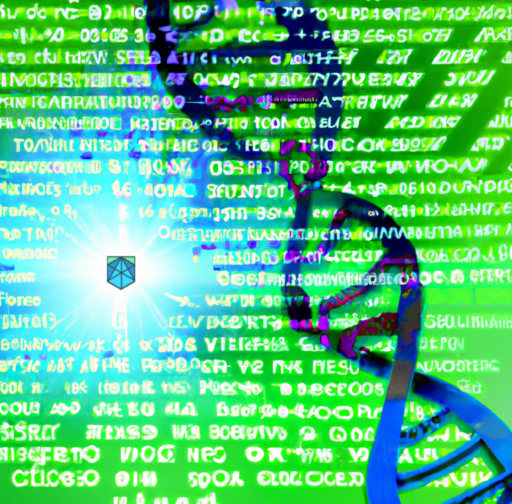

# &nbsp;Mutagenyx: Mutation Tool for AST Mutations

The Mutagenyx project exists to provide an abstract syntax tree (AST) mutator for multiple programming languages.
The internal frameworks developed for Mutagenyx allow developers to provide support for other programming languages
by implementing language specific modules and interfaces.  As long the language has an AST that the language compiler
can generate, developers can provide mutation support for that language with Mutagenyx.

Internally, Mutagenyx operates on abstract syntax trees.  The tool identifies potential nodes to mutate in the AST and
then directly modifies the AST in order to make the mutation.  The tool does not operate on source code. 
Once the tool has made a mutation it walks the AST and pretty-prints the AST back into source code form.

Mutagenyx can take source code files, language AST files, and [configuration files](#configuration-files) as input, and
then generate mutations from that input.  For source code, Mutagenyx will invoke the respective language's compiler to
generate the source code's AST.  Configuration files allow the user to provide more fine-grained control over how the
tool operates for a given set of input files. The configuration files allow the user to pass extra compiler information,
select mutation algorithms, and more.

Mutagenyx adds a comment node in the mutated program that records the mutation algorithm that caused the mutation
and the specific changes that the algorithm made.

## Build

Mutagenyx is a Rust program. To build Mutagenyx, do the following:

1. Download and install the latest Rust compiler tools from the Rust language [website](https://www.rust-lang.org/tools/install).
2. Clone the Mutagenyx repository:
   - `git clone git@github.com:Certora/mutagenyx.git`
3. Build Mutagenyx
    - In the `mutagenyx` directory run `cargo build -r` to build the release version of Mutagenyx.
    - If you would like to work with Mutagenyx outside the Mutagenyx source tree you can run
      `cargo install --path` from the `mutagenyx` directory to install the Mutagenyx binary to a location
      of your choice on your computer system.

## Requirements

Mutagenyx supports mutating multiple languages. You can find the specific requirements for each supported language
listed below.

### Solidity

To mutate Solidity programs, you will need to download and install compilers for Solidity programs from the
[solc-bin](https://github.com/etherium/solc-bin) repository. Select the appropriate compiler for the version of
Solidity that you need and the platform tha you are using and install the compiler in an easy-to-find directory.
Mutagenyx by default will try to use a Solidity compiler called `solc`.  If you choose not to specifically tell
Mutagenyx where to find the Solidity compiler, you will need to at least have a compiler named `solc` available
in a directory listed in your PATH environment variable.  Mutagenyx allows you to specify a specific Solidity compiler
by giving the path to the compiler using the command line argument `--solidity-compiler <path>`.  Mutagenyx will also
use a custom compiler specification in a `.mgnx` [configuration file](#configuration-files).  Set the path to the
compiler in the `path` key of the compiler-details object:

```json
{
  "compiler-details": {
      "path": "/path/to/solidity/compiler"
  }
}
```

#### Solidity Compiler Command Line Flags

The Solidity compiler supports the `--base-path` command line flag.  From the compiler documentation, this flag causes
the compiler to "use the given path as the root of the source tree instead of the root of the filesystem." You can add
the `"base-path"` key to the `"compiler-details"` object in the configuration file to provide a value for this compiler
flag.

The Solidity compiler supports the `--include-path` command line flag.  From the compiler documentation, this flag
causes the compiler to "make an additional source directory available to the default import callback. Use this option
if you want to import contracts whose location is not fixed in relation to your main source tree, e.g. third-party
libraries installed using a package manager. Can be used multiple times. Can only be used if base path has a non-empty
value."  You can add an array of include paths to the `"compiler-details"` object in the configuration file under the
key `"include-paths"`. Example:

```json
{
  "compiler-details": {
     "include-paths": [
        "/path/to/first",
        "/path/to/second"
     ]
  }
}
```

The Solidity compiler supports the concept of re-mappings of imports.  From the Solidity compiler: "Imports are
automatically read from the filesystem, but it is also possible to remap paths using the context:prefix=path syntax."
You can provide re-mappings by adding these mappings to the `"compiler-details"` section of the configuration file. You
can add an array of re-mappings using the `remappings` key.  Example:

```json
{
   "compiler-details": {
      "remappings": [
         "foo=/path/to/bar",
         "bat=/path/to/bing"
      ]
   }
}
```

### Vyper

To mutate Vyper programs, you will need to install a Vyper compiler using the instructions from the Vyper documentation
[website](https://docs.vyperlang.org/en/stable/installing-vyper.html).  Mutagenyx supports Vyper compilers in docker
containers and compilers installed using Python via pip.  By default, Mutagenyx will first attempt to use a compiler
named `vyper` from the command line (ie a pip installed compiler) and will fall back to attempting to use a docker
Vyper compiler.  You can specify a specific compiler version for Mutagenyx by using the `--vyper-compiler <path>`
command line flag. Mutagenyx will also use a custom compiler specification in a `.mgnx` configuration file.  Set the
path to the compiler in the `path` key of the compiler-details object:

```json
{
  "compiler-details": {
      "path": "/path/to/vyper/compiler"
  }
}
```

#### Vyper Compiler Command Line Flags

Mutagenyx has support for the Vyper compiler flag `-p <ROOT FOLDER>`. From the Vyper compiler documentation this flag
causes the compiler to "set the root path for contract imports." You can add the `"root-path"` key to the
`"compiler-details"` object in the configuration file to provide a value for this compiler flag.  Example:

```json
{
   "compiler-details": {
      "root-path": "/path/to/contract/import/root"
   }
}
```

## Usage

Mutagenyx has three different modes of operation:

* [Algorithms](#algorithms) - This mode provides information about the mutation algorithms supported by Mutagenyx.
* [Mutation](#mutation) - This mode generates mutations from source code, AST, or configuration file input.
* [Pretty-printing](#pretty-printing) - This mode generates source code from either program source code or AST input files using Mutagenyx's
pretty-printers.

### Algorithms

Mutagenyx supports a variety of mutation algorithms.  At any time you can get the most up-to-date list and descriptions
of the mutation algorithms from the tool itself by using the `algorithms` command line parameters.  To list the available
algorithms run: `mutagenyx algorithms -l`.  To get more detailed descriptions of the mutation algorithms run
`mutagenyx algorithms -d`.  (If you are using cargo, you can run `cargo run -- algorithms -l` and
`cargo run -- algorithms -d`.)

#### Mutation Algorithms

* ArithmeticBinaryOp - Randomly replace the arithmetic operator in a binary expression.
* Assignment - Replace right hand side of assignment expressions with type appropriate random alternative values.
* BitshiftBinaryOp - Randomly replaces a bitshift operator in a binary expression.
* BitwiseBinaryOp - Randomly replaces a bitwise operator in a binary expression.
* ComparisonBinaryOp - Randomly replace the comparison operator in a binary expression
* DeleteStatement - Randomly select a statement in a program block and delete the statement.
* ElimDelegateCall - Replace delegatecall() functions with call() (only valid for Solidity programs).
* FunctionCall - Replace function calls with one of the randomly selected arguments to the function call.
* SwapFunctionArguments - Randomly swap two arguments in a function call.
* IfStatement - Replace the condition expression in an if(c) statement with true, false, or the logical negation of the
condition if(!(c)).
* Integer - Randomly replace integer constants with random values.
* LinesSwap - Randomly select two statements in a block and swap the two statements.
* LogicalBinaryOp - Randomly replace the logical operator in a binary expression.
* SwapOperatorArguments - Swap left and right hand sides of binary expressions with non-commutative operators.
* Require - Randomly select a use of the Solidity require() function and replace the argument with the logical negation
of the argument expression.
* UnaryOp - Random replace unary operators for both prefix and postfix expressions with operators from the unary
operator list.
* UncheckedBlock - Randomly select an expression statement in a block of statements and decorate the statement with the
Solidity unchecked{} block.

### Mutation

Mutagenyx generates mutants using the `mutate` sub command.  On the command line run:<br><br>
`mutagenyx mutate [OPTIONS] --file-names <FILE_NAMES>...`

To get a full listing of all options available for the `mutate` sub-command, run `mutagenyx mutate -h`.

Two command line options control the selection of mutation algorithms:

* `-a` - Selects all available mutation algorithms
* `--mutations <Algorithms>` - Allows the user to elucidate specific algorithms.

The `-a` argument takes precedence over `--mutations`.

Mutagenyx can restrict mutations to individual functions using the `--functions` argument.

The `--num-mutants <NUMBER>` flag controls the number of mutants that Mutagenyx will generate.  Note that Mutagenyx
treats this number as an upper bound on the number of mutants that it generates.  Depending on the AST and the selected
mutation algorithms, Mutagenyx may automatically reduce the number of generated mutants depending on the availability
of mutable nodes in the AST for the mutation algorithms selected.

The `--rng-seed <NUMBER>` flag sets the seed (from an integer number) for the random number generator.  Use this flag
to reproduce sequences of mutations.  Without this seed value Mutagenyx will use a seed based on time.

The `--save-config-files` flag instructs Mutagenyx to generate a `.mgnx` [configuration file](#configuration-files) for
each input file.  You can use the generated `.mgnx` file for further customization.

The `--validate-mutants` flag instructs Mutagenyx to validate the viability of each generated mutant.  Currently,
Mutagenyx will attempt to compile each mutant and will only save mutants that compile to the output directory.

Note that Mutagenyx does always generate completely correct mutants.  Some mutations can alter programs in ways that
render the mutated program unusable.

Mutagenyx can write generated mutant programs to a directory specified with the `-o/--output-directory` command line flag,
or, it can write the programs to stdout when using the `--stdout` flag.

Use the `--functions` command line flag to give Mutagenyx a list of function names.  Mutagenyx will only mutate source
code in these named functions.  Without the `--functions` flag, Mutagenyx will generate mutations across the entire
program.

You can pass the paths to the Solidity and Vyper compilers using the `--solidity-compiler <PATH>` and
`--vyper-compiler <PATH>` command line flags respectively.

The `--print-original` flag instructs Mutagenyx to pretty-print the original source or AST file to the output directory.

### Pretty-printing

Mutagenyx can use its pretty-printing algorithms to pretty-print source or AST files without generating mutants.  

Note that since Mutagenyx operates on abstract syntax trees, the mutation process cannot preserve the original whitespace
of the source program (most compilers do not generate ASTs that contain the original program whitespace). Using the
pretty-printer feature allows you to easily compare the original source program to the mutated program without having to
deal with the hassle of trying to match the mutated version against the original source file.

Note also that compilers do not always preserve comments from the original source in the ASTs.  Without those comments
a diff between the original source file and the mutant file can have a lot of noise simply due to the lack of comments
in the mutated source code.  Where possible, Mutagenyx works to preserve comments from the original program, but the
tool can only preserve what the compiler allows into the AST.

Note that Mutagenyx does not provide source code formatting services (such as tools like
[clang-format](https://clang.llvm.org/docs/ClangFormat.html)) at this time.  

Two command line flags control where Mutagenyx writes the pretty-printed version of a source or AST file.
`-o/--output-directory <PATH>` tells Mutagenyx where to write the pretty-printed output.  `--stdout` tells Mutagenyx to
write the pretty-printed output to stdout.  `--stdout` takes precedence over `-o/--output-directory`.

You can pass the paths to the Solidity and Vyper compilers using the `--solidity-compiler <PATH>` and
`--vyper-compiler <PATH>` command line flags respectively.


## Configuration Files

In addition to source files and AST files generated by compilers, Mutagenyx supports passing input to the tool using
configuration files.  Mutagenyx configuration files have the file extension `.mgnx`.  Mutagenyx configuration files
use JSON formatting.  <mark>Important</mark>: Mutagenyx will reject any configuration file that does not have the `.mgnx` extension.
Mutagenyx configuration file settings will override parameters provided on the command line.

### Configuration file details

The Mutagenyx configuration file supports the following keys:

* `compiler-details` - A JSON object containing key/value pairs of settings specific to each compiler.  Each compiler
shares the `path` key which contains the location of the compiler in the file system. You can use relative paths for
`path` but the tool must exist in either a location available via the PATH environment variable or a relative offset
of the directory where the user invokes Mutagenyx. See [here](#solidity-compiler-command-line-flags) and
[here](#vyper-compiler-command-line-flags) for a discussion of language specific keys that can appear in the
`compiler-details` object.
* `filenames` - A JSON array of paths to input files.  You may only list source files or compiler AST files in this list
of filenames.  Mutagenyx does not support configuration files (`.mgnx`) files in this array of input files.
* `language` - A string with the name of the programming language used to generate ASTs from input source files. Currently,
Mutagenyx does not allow mixing different language files in the same configuration file.  This restriction means you
cannot list (for example) Vyper sources and Solidity sources in the same configuration file.
* `mutations` - An array of mutation algorithm names (as strings).
* `num-mutants` - The upper bound on the number of mutants that Mutagenyx will attempt to generate for each file in the
`filenames` array.
* `seed` - The seed value used for the random number generator in Mutagenyx.  Preserving the generator seed number in
the configuration file allows tools to deterministically generate mutations.  If the configuration file does not have a
value for the seed key, the tool will use the value from the command line argument `--rng-seed <SEED>` and if the user
did not pass that argument on the command line, then Mutagenyx will use a seed based on the current time (Mutagenyx does
not need cryptographically secure random number generation).
* `validate-mutants` - `true` if Mutagenyx should attempt to validate mutant viability and `false` otherwise.

## Output

In [mutate](#mutation) mode, Mutagenyx will generate mutated, pretty-printed, source files.  Each file should contain
a mutation accompanied by a comment describing the mutation that occurred:
```
// LogicalBinaryOp Mutator: changed '||' to '&&'
require(msg.sender == _fundsAdmin && msg.sender == _streams[streamId].recipient,
     "caller is not the funds admin or the recipient of the stream");
```

In [pretty-print](#pretty-printing) mode, Mutagenyx will pretty-print original source files and/or AST files using its
pretty-printing algorithms for the respective programming language.