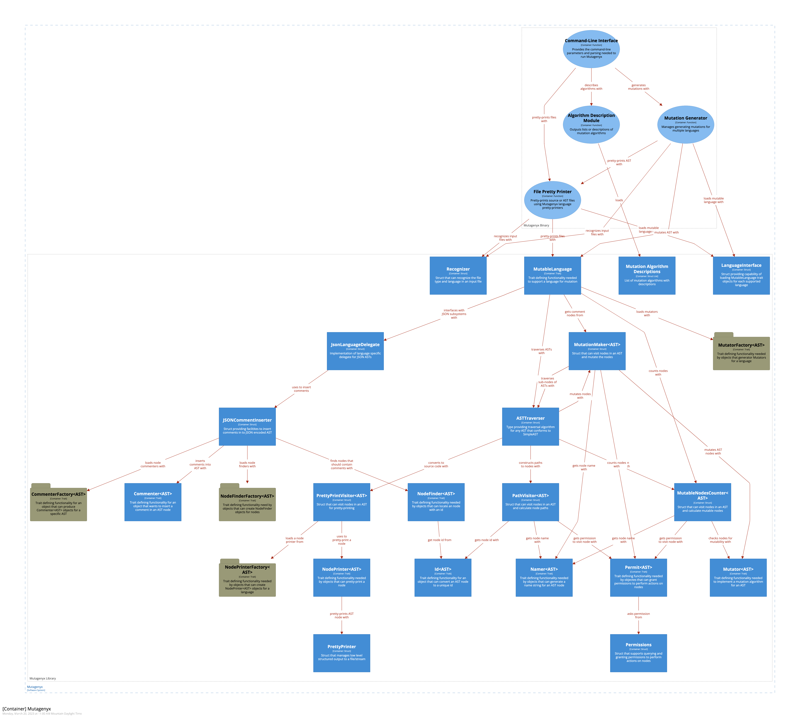
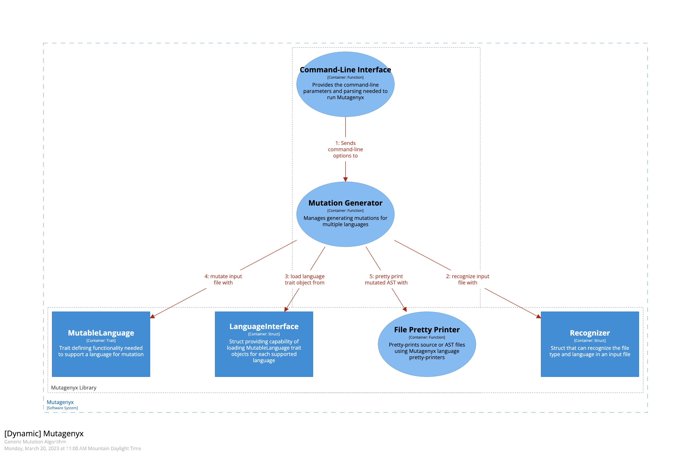
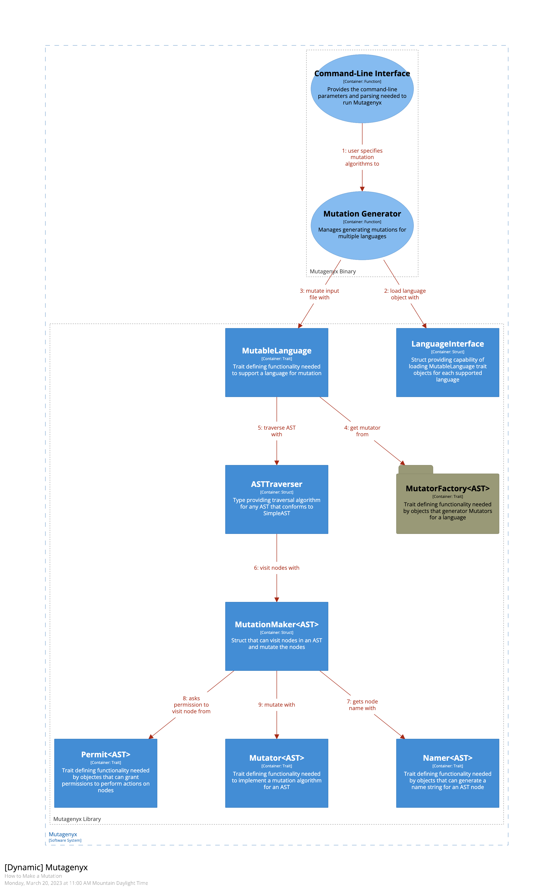
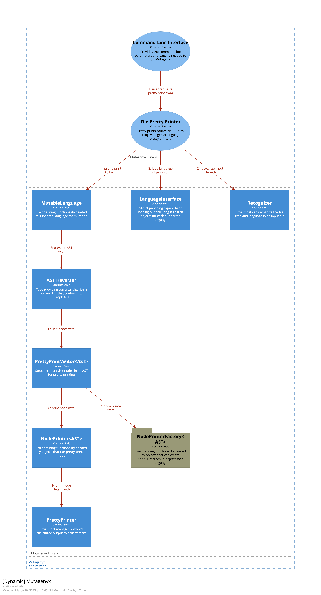
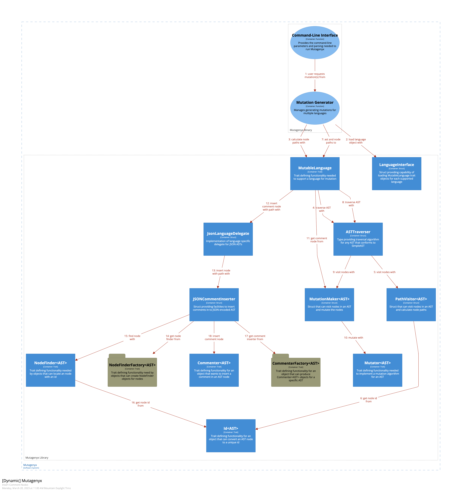

# &nbsp;Mutagenyx: Internal Design

## Basics

Mutagenyx has a primary binary application crate that:

- contains the code for handling input from the user
- the main mutation generation [algorithm](#mutation-algorithm)
- code for ensuring the tool creates unique [mutations](#mutation)
- code that handles writing mutation output

In addition to the binary application crate, Mutagenyx has a library crate that:

- abstracts working with [ASTs](#ast)
- abstracts working with mutation algorithms
- abstracts working with language-specific sub-systems
- declares and implements language specific mutations
- recognizes and categorizes input files and source code languages
- pretty-prints ASTs to source code

The Mutagenyx developers chose to build the tool in such a way as to preserve the original AST structure of the user's
input in order to more closely generate mutated code that resembles the original code.  The developers could have worked
on other solutions such as compiling the ASTs to a lower level IR and using the IR to generate mutations.  Compiling
to an IR form involves an inherent loss of information about the form and function of the original program and so instead
of losing that information we have chosen to directly implement the necessary abstractions on a language by language basis.
Ultimately, code-wise, this makes Mutagenyx a bit more difficult to extend, but gains the ability to more closely match
the original code (even in the mutated form).

The diagram below illustrates some basic dependencies between modules in the different crates: 
<small>Diagrams provided by [Structurizr](structurizr/README.md)</small>

## Execution Modes

### Mutation

Mutagenyx exists to create program mutations.  The following diagram explains the basic execution flow that Mutagenyx
follows when generating mutations.

The following graphic shows in more detail how the [MutableLanguage](#mutablelanguage) module performs the mutations:

### Pretty-printing files

Mutagenyx can print source files using its internal pretty-printers.  The following diagram illustrates the basic
tool behavior when pretty-printing source files.

## Inserting Comment Nodes

Some AST encodings (such as JSON) make inserting comment nodes difficult.  For these kinds of ASTs, Mutagenyx employs
the following algorithm and modules to insert comments into the AST:

## Glossary

###### Algorithm Description Module

Function that loads [mutation algorithm descriptions](#mutation-algorithm-description) and writes the list or
description of the algorithms to the process stdout stream.

###### AST

Abstract syntax tree(AST) representation of a program.  A programming language compiler converts a program into
an abstract syntax tree that accurately describes the semantics of a program according to the programming language's
grammar.  ASTs have the full meaning of the program encoded in the tree, however, most often they do not preserve
the original whitespace contents of the original program.

###### AST Traverser

A module of code that contains the algorithms for traversing the nodes of an AST.  The module provides traversal
functions for immutable and mutable visitors.

###### Command-Line Interface

Mutagenyx developers created Mutagenyx as a command-line application. Users can invoke the program using a command shell
interface.  Run the `mutagenyx` binary and pass command-line arguments to control the behavior of the tool.

###### Commenter

An object that can insert a comment node into node's children in a node-type appropriate way.

###### Commenter Factory

Language specific module that can generate [Commenter](#commenter) objects that can insert a comment node into a node
in the AST.

###### File Pretty-Printer

Functions responsible for converting an AST back to source code using language specific pretty-printers.

###### Id Trait

API for functionality that an object can provide to convert a node from an AST to a node id.

###### JSON Comment Inserter

An abstraction for all JSON encoded ASTs that provides the functionality to insert a comment node into a JSON encoded
AST.

###### JSON Language Delegate

Mutagenyx contains an abstraction layer for languages that encode their ASTs in JSON.  These languages share the
same semantics of traversing and interacting with a JSON encode AST even though the actual ASTs contain very different
data.  The JSON [MutableLanguage](#mutablelanguage) code relies on language specific delegates that provide the
language-specific functionality to work with different kinds of ASTs in JSON.

###### Language Interface

Module that knows about the languages supported by Mutagenyx.  Use this module to get a
[MutableLanguage](#mutablelanguage) trait object for a particular language.

###### MutableLanguage

A trait that defines the interface to programming language specific functionality. The trait provides the following
services (not an exhaustive list):

- load a language specific [AST](#ast) from a file
- marshall [mutators](#mutator) to mutate an AST
- traverse an AST and count the mutable nodes in the AST for a set of [mutation algorithms](#mutation-algorithm)
- mutate an AST
- pretty-print an AST to a file
- pretty-print an AST to an output stream
- get the file extension for language specific source code files
- check if an input file is a source code file
- check if an input file is an AST file
- convert a source file into an AST
- retrieve the default compiler settings for the language
- check if a mutated program will compile

###### MutableNodeCounter

A visitor that will count the nodes in the AST that can be mutated by mutation algorithm.

###### Mutation

A change in a program, introduced to purposefully create a bug in the program.

###### Mutation Algorithm

Algorithm that details the steps to take to mutate an AST in a particular manner.

###### Mutation Algorithm Description

A module of code that lists the [mutation algorithms](#mutation-algorithm) support by the tool.  Each algorithm
also has a corresponding set of documentation to describe the behavior of the algorithm.

###### Mutator Factory

A module of code provided by each language implementation that can [Mutators](#mutator) that can mutate a specific
kind of AST.

###### Mutation Generator

Function responsible for running the primary mutation algorithm.

###### Mutation Maker

A [VisitorMut](#visitormut) trait object that the mutation algorithm uses to traverse an AST.  This visitor will mutate the AST and
also generate a comment node.

###### Mutator

A trait object of type `Mutator<AST>`.  Mutators can identify mutable nodes in an AST and perform the mutations on the
mutable nodes.  Each mutator implements a specific mutation algorithm.

###### Namer

Defines the API for an object that can convert a node from an AST into a string name.

###### NodeFinder

An object that can inspect a node of an AST to see if the node contains a specific node id as a child.

###### NodeFinder Factory

An object that can produce [NodeFinder](#nodefinder) objects for nodes of an AST.

###### NodePrinter

An object that can print a node from an AST.

###### NodePrinter Factory

An object that can produce [NodePrinter](#nodeprinter) objects for nodes of an AST.

###### Path Visitor

A visitor that can visit all the nodes in an AST and record the paths from the root node to the current node by node id.

###### Permissions

An object that contains permission settings for doing certain tasks.

###### Permit

Defines the API for an object that code can query for permission to perform certain operations.

###### Pretty-print Visitor

A visitor that can use [NodePrinter](#nodeprinter) objects to pretty-print an AST.

###### PrettyPrinter

A low level token emitter that the [NodePrinter](#nodeprinter) objects use to emit output content to a stream. The
printer keeps track of indentation, columns, line breakes, etc...

###### Recognizer

An object that handles recognizing the type of input file (source, AST, configuration file) and the programming
language used in the input file (Solidity, Vyper, etc...).

###### VisitorMut

A trait object that can visit each node during an AST traversal and can mutate nodes.